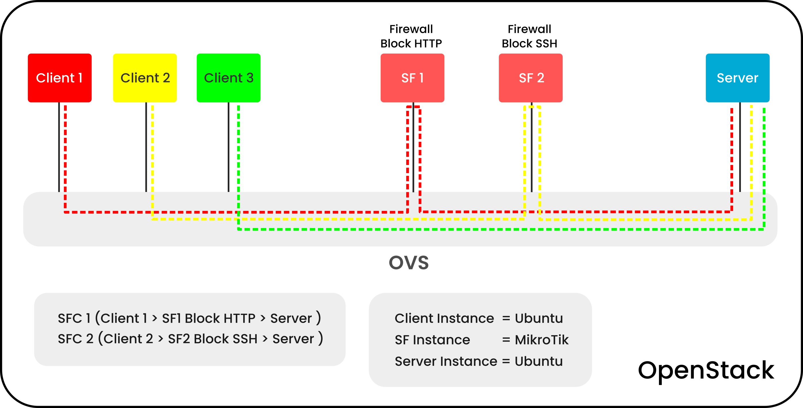

# Demo & Scenario Service Function Chain (SFC) on OpenStack

## Service Function Chaining ?
Lorem Ipsum is simply dummy text of the printing and typesetting industry. Lorem Ipsum has been the industry's standard dummy text ever since the 1500s, when an unknown printer took a galley of type and scrambled it to make a type specimen book. It has survived not only five centuries, but also the leap into electronic typesetting, remaining essentially unchanged. It was popularised in the 1960s with the release of Letraset sheets containing Lorem Ipsum passages, and more recently with desktop publishing software like Aldus PageMaker including versions of Lorem Ipsum.

## Demo Skenario
###


## Goal
Lorem Ipsum is simply dummy text of the printing and typesetting industry. Lorem Ipsum has been the industry's standard dummy text ever since the 1500s, when an unknown printer took a galley of type and scrambled it to make a type specimen book. It has survived not only five centuries, but also the leap into electronic typesetting, remaining essentially unchanged. It was popularised in the 1960s with the release of Letraset sheets containing Lorem Ipsum passages, and more recently with desktop publishing software like Aldus PageMaker including versions of Lorem Ipsum.

## Requirements
Linux Ubuntu 18.04

Minimal Hardware :

- RAM 
- Harddisk

## Documentation
Youtube : 

## Demo 
Note : this demo should run on ubuntu 18.04 LTS

1.  Download Demo

```sh
$ git clone https://github.com/muhammadluthfias/openstack-sfc.git
```

2. Install Requirements

```sh
$ cd openstack-sfc
$ ./install.sh
```

3. Devstack Configuration

    Change IP Address in local.conf, example :
    - HOST_IP=192.168.1.1
   
```sh
$ cd devstack
$ sudo nano local.conf
```

```sh
[[local|localrc]]
############################################################
# Customize the following HOST_IP based on your installation
############################################################
HOST_IP=[CHANGE_LOCAL_IP]

Q_USE_PROVIDERNET_FOR_PUBLIC=True
OVS_PHYSICAL_BRIDGE=br-ex
PUBLIC_BRIDGE=br-ex
OVS_BRIDGE_MAPPINGS=public:br-ex
ONBOOT=yes

ADMIN_PASSWORD=secret
MYSQL_PASSWORD=secret
RABBIT_PASSWORD=secret
SERVICE_PASSWORD=$ADMIN_PASSWORD
SERVICE_TOKEN=secret

############################################################
# Customize the following section based on your installation
############################################################

# Pip
PIP_USE_MIRRORS=False
USE_GET_PIP=1

#OFFLINE=False
#RECLONE=True

# Logging
LOGFILE=$DEST/logs/stack.sh.log
VERBOSE=True
ENABLE_DEBUG_LOG_LEVEL=True
ENABLE_VERBOSE_LOG_LEVEL=True

# Neutron ML2 with OpenVSwitch
Q_PLUGIN=ml2
Q_AGENT=openvswitch

# Disable security groups
Q_USE_SECGROUP=False
LIBVIRT_FIREWALL_DRIVER=nova.virt.firewall.NoopFirewallDriver

# networking-sfc
enable_plugin networking-sfc https://git.openstack.org/openstack/networking-sfc master

enable_service n-novnc
enable_service n-cauth

disable_service tempest

[[post-config|/etc/neutron/dhcp_agent.ini]]
[DEFAULT]
enable_isolated_metadata = True
```

4. Running Configuration
```sh
$ ./stack.sh
```


